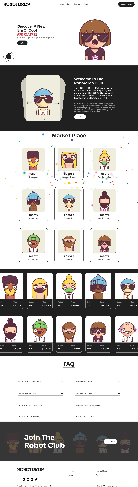

# Personal Project - MFT-Marketplace landing page

## Table of contents

- [Screenshot](#screenshot)
- [Links](#links)
- [My process](#my-process)
  - [Built with](#built-with)
- [Author](#author)

### Screenshot

### Links

- Live URL: [Live site](https://marketplace-five-nu.vercel.app/)

## My process

### Built with

- Semantic HTML5 markup
- CSS custom properties
- Flexbox
- [React](https://reactjs.org/) - JS library
- styled-components

## Author

- Website - [Daniyal Tayyab](https://www.your-site.com)
- Frontend Mentor - [@daniyal-tayyab](https://www.frontendmentor.io/profile/daniyal-tayyab)
- Twitter - [@dani_bagga](https://www.twitter.com/dani_bagga)
